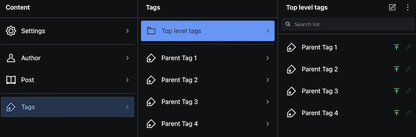

# sanity-plugin-tag-hierarchy

> This is a **Sanity Studio v3** plugin.

A multi-tag input supporting tag hierarchy (max 2 levels), grouping tagged documents in Desk tool and browsing documents by tags in the Studio.

## Installation

```sh
npm install sanity-plugin-tag-hierarchy
```

## Usage

Add it as a plugin in `sanity.config.ts` (or .js):

```ts
import {defineConfig} from 'sanity'
import {tagHierarchy} from 'sanity-plugin-tag-hierarchy'

export default defineConfig({
  //...
  plugins: [tagHierarchy({})],
})
```

### Parent/child tags
This plugin supports tag hierarchy of 2 levels: **Parent** and **Child**.

A "**Parent**" Tag is any tag document that does not have the parent field defined.

A "**Child**" Tag is any tag document with a parent field reference.

### Add tag input to schema
Allow selecting multiple tags, but only child tags:
```ts
defineField({
  name: 'tags',
  type: 'array',
  of: [
    {
      type: 'reference',
      to: {type: 'tag'},
      options: {
        filter: 'defined(parent)',
        disableNew: true,
      },
    }
  ]
})
```
#### Screenshot: Tag reference in Post document


### Add Parent-Child tag structure in Desk
```ts
import { createDeskHierarchy } from 'sanity-plugin-tag-hierarchy'

export default defineConfig({
  plugins: [
    deskTool({
      structure: (S: StructureBuilder, context: StructureResolverContext) => {
        return S.list()
          .title('Content')
          .items([
            createDeskHierarchy(S, context.documentStore, 'Tags')
          ])
      },
    }),
  ]
})
```

#### Screenshot: Parent tag structure in Sanity Desk


#### Screenshot: Child tag structure in Sanity Desk


## License

[MIT](LICENSE) © Ismar Slomic

## Develop & test

This plugin uses [@sanity/plugin-kit](https://github.com/sanity-io/plugin-kit)
with default configuration for build & watch scripts.

See [Testing a plugin in Sanity Studio](https://github.com/sanity-io/plugin-kit#testing-a-plugin-in-sanity-studio)
on how to run this plugin with hotreload in the studio.
